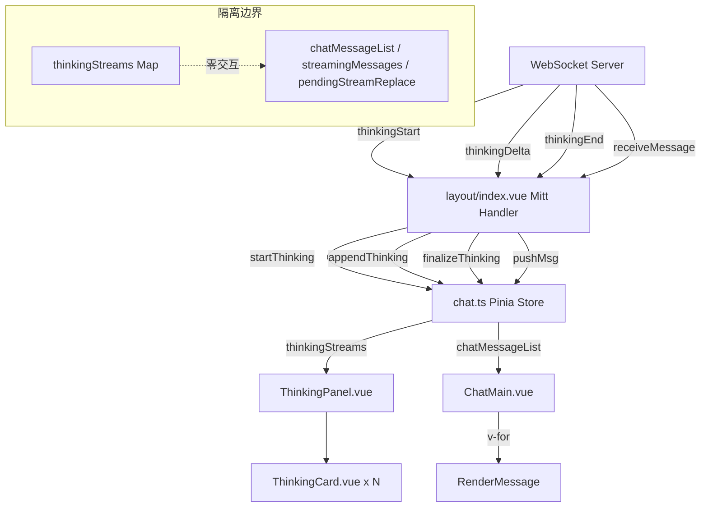

# REQ-004 前端详细设计文档

> 编写：frontend-dev
> 日期：2026-05-20
> 版本：v1.3（M2 回顾后微调 status 字段注释）
> 输入：需求.md v2.1 + feasibility-frontend.md + design-tasks.md §2.3 + manager D1-D4 决策 + server-dev/plugin-dev 跨组对齐
> 关联：design-server.md (server-dev) / design-plugin.md (plugin-dev)
>
> v1.0 → v1.1 变更日志：
> - D1：私聊 AI 助理本期也切换为 ThinkingPanel（+0.3 天）
> - D2：extra 字段放在 MsgType 顶层（server-dev 已确认）
> - D3：@ 触发选项本期完整实现，UI 不 disabled
> - D4：归档延迟保持 30s
> - thinkingId 改为 server 生成（Long 自增主键），前端接收 String
> - X2：autoReply 不入库，仅在 WS payload 携带（前端从 WS 事件检查，不从 MsgType.extra 检查）
> - X5：群配置 WS 通知推送范围改为群内所有在线成员 + aichat-node

---

## 1. 概述

### 1.1 关联需求条目

| 需求章节 | 前端职责 |
|----------|---------|
| §2.3 消息机制 Agent Loop | THINKING_* WS 事件处理 + thinkingStreams 状态管理 |
| §2.3.3 消息投递方式 | MCP Tool 正式消息走现有 `RECEIVE_MESSAGE` 通道，前端零改动 |
| §2.4 防循环 | 前端识别 `autoReply` 消息，展示限流说明但跳过触发 |
| §3.1 WS 事件类型 | `wsType.ts` 新增 3 个 enum + DTO 类型 |
| §3.2 Thinking Payload | 接收并解析 server 推送的 thinking 事件 |
| §5.1 Thinking 展示 | ThinkingPanel + ThinkingCard 组件实现 |
| §5.2 群配置入口 | aiclaw 管理页新增群聊设置子视图 |

### 1.2 设计原则

1. **隔离原则**：`thinkingStreams` 与 `chatMessageList` / `streamingMessages` / `pendingStreamReplace` 完全隔离，不共享任何状态
2. **复用原则**：WS 事件处理复用现有 Mitt + rAF 节流模式；UI 组件复用现有 Naive UI / UnoCSS 生态
3. **渐进原则**：本期优先桌面端完整实现，移动端复用桌面 `ChatMain` 组件（已验证可工作）

---

## 2. 整体架构

### 2.1 数据流



### 2.2 模块依赖图

```
wsType.ts (新增 enum + DTO)
    ↓
layout/index.vue (Mitt 监听 + rAF 节流)
    ↓
chat.ts (thinkingStreams + 4 actions)
    ↓
ChatMain.vue (替换 AI notice bar → ThinkingPanel)
    ↓
ThinkingPanel.vue (容器，按 roomId 过滤)
    ↓
ThinkingCard.vue (单卡片 UI)
```

---

## 3. 详细设计

### 3.1 WS 事件类型定义 — `wsType.ts`

**文件**：`src/services/wsType.ts`

**新增内容**：

```typescript
// WsResponseMessageType enum 新增 3 个成员（追加在 AICLAW_AUTH_REQUEST 之后）

/** AI 助理思考开始 */
THINKING_START = 'thinkingStart',
/** AI 助理思考内容增量 */
THINKING_DELTA = 'thinkingDelta',
/** AI 助理思考结束 */
THINKING_END = 'thinkingEnd',
/** 群聊配置变更通知 */
AICLAW_GROUP_CONFIG_UPDATE = 'aiclawGroupConfigUpdate',

// ==================== AIclaw Thinking Payload ====================

/** 思考开始 payload（server → client） */
export type ThinkingStartPayload = {
  /** 思考会话 ID（由 server 生成，im_aiclaw_thinking 自增主键序列化为 string） */
  thinkingId: string
  /** aiclaw 用户 ID */
  fromUid: number
  /** 房间 ID */
  roomId: number
  /** 触发消息 ID（可选） */
  triggerMsgId?: string
  /** aiclaw 显示名（方便前端直接使用） */
  aiclawName?: string
  /** aiclaw 头像 URL（可选，前端可从 groupStore 回查） */
  aiclawAvatar?: string
}

/** 思考内容增量 payload（server → client） */
export type ThinkingDeltaPayload = {
  /** 关联的思考会话 ID */
  thinkingId: string
  /** 房间 ID */
  roomId: number
  /** 内容增量 */
  chunk: string
  /** 序号（从 1 开始） */
  seq: number
}

/** 思考结束 payload（server → client） */
export type ThinkingEndPayload = {
  /** 关联的思考会话 ID */
  thinkingId: string
  /** 房间 ID */
  roomId: number
  /** 处理耗时（毫秒） */
  durationMs?: number
  /** 结束状态（由 server 推送，server/plugin v1.3 已对齐） */
  status: 'complete' | 'error'
  /** 错误信息（status=error 时） */
  errorMsg?: string
}

/** 群配置变更通知 payload（server → client，仅推送给 aiclaw 主人） */
export type AiclawGroupConfigUpdatePayload = {
  /** aiclaw 用户 ID */
  aiclawUid: number
  /** 房间 ID */
  roomId: number
  /** 完整配置对象（前端直接替换本地缓存） */
  config: AiclawGroupConfig
}

/** 群聊 aiclaw 配置类型 */
export type AiclawGroupConfig = {
  /** 频率限制（条/分钟，0=无限制） */
  rateLimitPerMinute: number
  /** 每日上限 */
  dailyLimit: number
  /** 是否响应其他 aiclaw */
  respondToAi: boolean
  /** 是否需要 @ 触发（本期预留，默认 false） */
  mentionRequired?: boolean
}
```

**X1 跨组对齐结论（v1.1 已修正）**：
- `thinkingId`：由 **server 生成**（`im_aiclaw_thinking` 自增主键），前端接收为 `string` 类型（Long → 字符串，避免 JS 精度问题，与现有 `ChatMessageResp.Message.id` 风格一致）。aichat-node 发送 THINKING_START_REQ 时不携带 thinkingId，server 生成后通过 THINKING_START 响应回传
- `fromUid` / `roomId`：与现有 `StreamStartPayload` 保持一致
- `aiclawName` / `aiclawAvatar`：由 server 从 `im_user` / `im_aiclaw` 表回填，减少前端二次查询。若 server 不便回填，前端从 `groupStore.getUserInfo(fromUid)` 获取（降级方案）
- `triggerMsgId`：可选字段，用于 UI 中 "由 xxx 消息触发" 的展示

### 3.2 Chat Store 扩展 — `chat.ts`

**文件**：`src/stores/chat.ts`

#### 3.2.1 新增类型定义

```typescript
/** 思考状态 */
type ThinkingStatus = 'thinking' | 'complete' | 'error'

/** 单个 aiclaw 的思考状态 */
type ThinkingState = {
  /** 思考会话 ID（与 WS thinkingId 对应） */
  thinkingId: string
  /** aiclaw 用户 ID */
  aiclawId: number
  /** aiclaw 显示名 */
  aiclawName: string
  /** aiclaw 头像 */
  aiclawAvatar: string
  /** 房间 ID */
  roomId: string
  /** 当前思考内容（流式追加） */
  content: string
  /** 思考状态 */
  status: ThinkingStatus
  /** 开始时间戳 */
  startTime: number
  /** 结束时间戳（THINKING_END 时设置） */
  endTime?: number
  /** 处理耗时（毫秒，THINKING_END 时设置） */
  durationMs?: number
  /** 错误信息（status=error 时） */
  errorMsg?: string
  /** 触发消息 ID */
  triggerMsgId?: string
  /** delta 序号（用于去重） */
  lastSeq: number
  /** 是否已折叠（UI 状态，THINKING_END 后默认折叠） */
  collapsed: boolean
}
```

#### 3.2.2 新增状态

```typescript
// ==================== AIclaw Thinking 状态 ====================

/**
 * 思考流状态 Map
 * key 格式：`${roomId}:${aiclawId}`（同房间不同 aiclaw 独立）
 * 与 chatMessageList / streamingMessages / pendingStreamReplace 完全隔离
 */
const thinkingStreams = reactive(new Map<string, ThinkingState>())

/**
 * 已完成思考的归档列表（按 roomId 分组）
 * key: roomId, value: ThinkingState[]
 * 保留最近 10 条已完成思考，供回顾
 */
const thinkingArchive = reactive(new Map<string, ThinkingState[]>())

/** 当前房间是否有活跃思考 */
const isCurrentRoomThinking = computed(() => {
  const roomId = globalStore.currentSessionRoomId
  if (!roomId) return false
  for (const [, state] of thinkingStreams) {
    if (state.roomId === roomId && state.status === 'thinking') {
      return true
    }
  }
  return false
})

/** 当前房间的活跃思考列表（computed，供 ThinkingPanel 使用） */
const currentRoomThinkings = computed(() => {
  const roomId = globalStore.currentSessionRoomId
  if (!roomId) return []
  const result: ThinkingState[] = []
  for (const [, state] of thinkingStreams) {
    if (state.roomId === roomId) {
      result.push(state)
    }
  }
  return result
})
```

#### 3.2.3 新增 Actions

```typescript
/** 开始思考（THINKING_START 时调用） */
const startThinking = (payload: ThinkingStartPayload) => {
  const roomId = String(payload.roomId)
  const aiclawId = payload.fromUid
  const key = `${roomId}:${aiclawId}`

  // 如果该 aiclaw 在该房间已有未完成的思考，先归档旧的
  const existing = thinkingStreams.get(key)
  if (existing && existing.status === 'thinking') {
    existing.status = 'error'
    existing.errorMsg = 'Superseded by new thinking'
    existing.endTime = Date.now()
    archiveThinking(existing)
  }

  // 从 groupStore 获取名称和头像（降级：使用 payload 中的值或默认值）
  const groupStore = useGroupStore()
  const userInfo = groupStore.getUserInfo(String(aiclawId))

  thinkingStreams.set(key, {
    thinkingId: payload.thinkingId,
    aiclawId,
    aiclawName: payload.aiclawName || userInfo?.name || 'AI',
    aiclawAvatar: payload.aiclawAvatar || userInfo?.avatar || '',
    roomId,
    content: '',
    status: 'thinking',
    startTime: Date.now(),
    triggerMsgId: payload.triggerMsgId,
    lastSeq: 0,
    collapsed: false
  })
}

/** 追加思考内容（THINKING_DELTA 时调用，已由 rAF 节流） */
const appendThinking = (roomId: string, thinkingId: string, delta: string, seq: number) => {
  // 通过 thinkingId 查找对应的 ThinkingState
  for (const [key, state] of thinkingStreams) {
    if (state.thinkingId === thinkingId) {
      // 序号去重：只接受 > lastSeq 的 delta
      if (seq > state.lastSeq) {
        state.content += delta
        state.lastSeq = seq
      }
      return
    }
  }
}

/** 结束思考（THINKING_END 时调用） */
const finalizeThinking = (roomId: string, thinkingId: string, payload: ThinkingEndPayload) => {
  for (const [key, state] of thinkingStreams) {
    if (state.thinkingId === thinkingId) {
      state.status = payload.status
      state.endTime = Date.now()
      state.durationMs = payload.durationMs
      state.errorMsg = payload.errorMsg
      state.collapsed = true  // 完成后默认折叠
      // 延迟归档：30 秒后移入 archive
      setTimeout(() => {
        archiveThinking(state)
        thinkingStreams.delete(key)
      }, 30_000)
      return
    }
  }
}

/** 归档已完成的思考（内部方法） */
const archiveThinking = (state: ThinkingState) => {
  const roomId = state.roomId
  if (!thinkingArchive.has(roomId)) {
    thinkingArchive.set(roomId, [])
  }
  const archive = thinkingArchive.get(roomId)!
  archive.unshift(state)  // 最新的在前
  // 限制归档数量
  if (archive.length > 10) {
    archive.length = 10
  }
}

/** 清理思考状态（切换房间或手动关闭时） */
const clearThinking = (roomId?: string, aiclawId?: number) => {
  if (roomId && aiclawId) {
    thinkingStreams.delete(`${roomId}:${aiclawId}`)
  } else if (roomId) {
    for (const [key, state] of thinkingStreams) {
      if (state.roomId === roomId) {
        thinkingStreams.delete(key)
      }
    }
  } else {
    thinkingStreams.clear()
  }
}

/** 切换思考卡片折叠状态 */
const toggleThinkingCollapse = (roomId: string, aiclawId: number) => {
  const key = `${roomId}:${aiclawId}`
  const state = thinkingStreams.get(key)
  if (state) {
    state.collapsed = !state.collapsed
  }
}
```

#### 3.2.4 Store 导出

```typescript
return {
  // ... existing exports
  
  // thinking
  thinkingStreams,
  thinkingArchive,
  isCurrentRoomThinking,
  currentRoomThinkings,
  startThinking,
  appendThinking,
  finalizeThinking,
  clearThinking,
  toggleThinkingCollapse,
}
```

#### 3.2.5 隔离边界确认（ISS-015 兼容性保证）

| 现有状态/逻辑 | thinkingStreams 是否触及 | 说明 |
|--------------|------------------------|------|
| `chatMessageList: MessageType[]` | **否** | thinking 不进入消息列表 |
| `messageMap: Record<roomId, Record<msgId, MessageType>>` | **否** | thinking 不进入消息映射 |
| `streamingMessages: Set<string>` | **否** | thinking 用独立 `thinkingStreams` Map |
| `pendingStreamReplace: Map<string, string[]>` | **否** | MCP Tool 消息走 `RECEIVE_MESSAGE`，走现有 `pushMsg` + `tryReplaceStreamPlaceholder` |
| `pushMsg()` 消息推送 | **否** | thinking 不调用 pushMsg |
| `normalizeMsgSendTime()` 时间戳归一化 | **否** | thinking 用独立 `startTime/endTime` |
| `clearRedundantMessages()` 清理 | **否** | thinking 不在此流程中 |
| `startStream()` / `appendStreamContent()` / `finalizeStream()` | **否** | 完全独立的 action |

**保证**：thinking 新增的 4 个 action 不调用任何现有消息处理函数。thinking 内容不进入 `chatMessageList`，不经过排序、去重、placeholder 替换逻辑。ISS-015 修复的 `sendTime` 排序和 `pendingStreamReplace` 多槽数组完全不受影响。

### 3.3 WS 事件处理 — `layout/index.vue`

**文件**：`src/layout/index.vue`

**新增内容**（追加在现有 STREAM_END handler 之后）：

```typescript
// ==================== AIclaw Thinking 事件处理 ====================

const thinkingDeltaBuffers = new Map<string, {
  roomId: string
  thinkingId: string
  content: string
  lastSeq: number
}>()
let thinkingRafId: number | null = null

useMitt.on(WsResponseMessageType.THINKING_START, (data: ThinkingStartPayload) => {
  chatStore.startThinking(data)
})

useMitt.on(WsResponseMessageType.THINKING_DELTA, (data: ThinkingDeltaPayload) => {
  // rAF 节流：与 STREAM_DELTA 相同模式
  const key = data.thinkingId
  const existing = thinkingDeltaBuffers.get(key)
  if (existing) {
    existing.content += data.chunk
    existing.lastSeq = data.seq
  } else {
    thinkingDeltaBuffers.set(key, {
      roomId: String(data.roomId),
      thinkingId: data.thinkingId,
      content: data.chunk,
      lastSeq: data.seq
    })
  }

  if (!thinkingRafId) {
    thinkingRafId = requestAnimationFrame(() => {
      for (const [, buf] of thinkingDeltaBuffers) {
        chatStore.appendThinking(buf.roomId, buf.thinkingId, buf.content, buf.lastSeq)
      }
      thinkingDeltaBuffers.clear()
      thinkingRafId = null
    })
  }
})

useMitt.on(WsResponseMessageType.THINKING_END, (data: ThinkingEndPayload) => {
  // 刷新剩余 buffer
  const buf = thinkingDeltaBuffers.get(data.thinkingId)
  if (buf) {
    chatStore.appendThinking(buf.roomId, data.thinkingId, buf.content, buf.lastSeq)
    thinkingDeltaBuffers.delete(data.thinkingId)
  }
  chatStore.finalizeThinking(String(data.roomId), data.thinkingId, data)
})

useMitt.on(WsResponseMessageType.AICLAW_GROUP_CONFIG_UPDATE, (data: AiclawGroupConfigUpdatePayload) => {
  // 刷新本地配置缓存
  chatStore.updateAiclawGroupConfig(data.aiclawUid, data.roomId, data.config)

  // 非主人的群成员：展示配置变更提示（X5：推送范围为群内所有在线成员）
  if (!isAiclawOwner(data.aiclawUid)) {
    const aiclawName = chatStore.getAiclawName(data.aiclawUid) || 'AI'
    window.$message?.info(t('aiclaw.group_settings.config_changed', { name: aiclawName }), { duration: 5000 })
  }
})
```

**rAF 隔离说明**：`thinkingDeltaBuffers` 和 `thinkingRafId` 与现有 `streamDeltaBuffers` / `streamRafId` 完全独立，各自维护自己的缓冲区和动画帧回调。两者互不影响。

### 3.4 UI 组件设计

#### 3.4.1 ThinkingPanel.vue

**文件**：`src/components/rightBox/chatBox/ThinkingPanel.vue`（新建）

**职责**：
- 从 `chatStore.currentRoomThinkings` 获取当前房间的思考列表
- 渲染多个 ThinkingCard
- 管理面板展开/收起（当所有 thinking 完成且折叠后，面板收起为紧凑入口）
- 展示归档思考的回顾入口

**Props**：无（直接从 store 读取）

**模板骨架**：

```vue
<template>
  <Transition name="thinking-panel" mode="out-in">
    <!-- 有活跃思考 或 有未归档的已完成思考 -->
    <div v-if="activeThinkings.length > 0" class="thinking-panel flex-shrink-0 px-12px pt-6px">
      <div class="flex flex-col gap-4px">
        <ThinkingCard
          v-for="thinking in activeThinkings"
          :key="thinking.thinkingId"
          :thinking="thinking"
          @toggle-collapse="handleToggleCollapse(thinking)"
        />
      </div>
    </div>
    <!-- 所有思考已归档，显示回顾入口 -->
    <div
      v-else-if="hasArchivedThinkings"
      class="flex-shrink-0 px-12px pt-6px"
      @click="showArchiveDrawer = true">
      <div class="flex items-center gap-6px px-12px py-6px rounded-6px bg-#7c5cfc08 text-(12px #7c5cfc) cursor-pointer hover:bg-#7c5cfc15 transition-colors">
        <svg class="size-14px flex-shrink-0"><use href="#robot"></use></svg>
        {{ t('aiclaw.thinking.archive_entry', { count: archivedCount }) }}
      </div>
    </div>
  </Transition>

  <!-- 归档抽屉 -->
  <n-drawer v-model:show="showArchiveDrawer" :width="360" placement="right">
    <n-drawer-content :title="t('aiclaw.thinking.archive_title')">
      <ThinkingCard
        v-for="thinking in archivedThinkings"
        :key="thinking.thinkingId"
        :thinking="thinking"
        :readonly="true"
      />
      <n-empty v-if="archivedThinkings.length === 0" :description="t('aiclaw.thinking.archive_empty')" />
    </n-drawer-content>
  </n-drawer>
</template>
```

**脚本骨架**：

```typescript
const chatStore = useChatStore()
const showArchiveDrawer = ref(false)

const activeThinkings = computed(() => chatStore.currentRoomThinkings)

const hasArchivedThinkings = computed(() => {
  const roomId = globalStore.currentSessionRoomId
  if (!roomId) return false
  return (chatStore.thinkingArchive.get(roomId)?.length ?? 0) > 0
})

const archivedThinkings = computed(() => {
  const roomId = globalStore.currentSessionRoomId
  if (!roomId) return []
  return chatStore.thinkingArchive.get(roomId) ?? []
})

const archivedCount = computed(() => archivedThinkings.value.length)

const handleToggleCollapse = (thinking: ThinkingState) => {
  chatStore.toggleThinkingCollapse(thinking.roomId, thinking.aiclawId)
}
```

#### 3.4.2 ThinkingCard.vue

**文件**：`src/components/rightBox/chatBox/ThinkingCard.vue`（新建）

**Props**：

```typescript
const props = defineProps<{
  thinking: ThinkingState
  readonly?: boolean  // 归档模式：不可折叠，只读展示
}>()

const emit = defineEmits<{
  'toggle-collapse': []
}>()
```

**模板骨架**：

```vue
<template>
  <div
    class="thinking-card rounded-8px border border-#7c5cfc20 bg-#7c5cfc08 overflow-hidden transition-all duration-200"
    :class="{ 'cursor-pointer': !readonly }"
    @click="!readonly && emit('toggle-collapse')">
    <!-- 头部：头像 + 名称 + 状态 -->
    <div class="flex items-center gap-8px px-12px py-8px">
      <n-avatar :size="20" :src="thinking.aiclawAvatar || '/logo.png'" fallback-src="/logo.png" round />
      <span class="text-(12px font-500 [#333] dark:[--text-color]) truncate">
        {{ thinking.aiclawName }}
      </span>
      <!-- 状态徽章 -->
      <span v-if="thinking.status === 'thinking'" class="flex items-center gap-4px text-(11px #7c5cfc)">
        <span class="thinking-dot size-6px rounded-50% bg-#7c5cfc animate-pulse" />
        {{ t('aiclaw.thinking.status.thinking') }}
      </span>
      <span v-else-if="thinking.status === 'complete'" class="text-(11px #13987f)">
        {{ t('aiclaw.thinking.status.complete', { duration: formattedDuration }) }}
      </span>
      <span v-else-if="thinking.status === 'error'" class="text-(11px [--danger-text])">
        {{ t('aiclaw.thinking.status.error') }}
      </span>
      <!-- 展开/收起图标（仅非归档模式） -->
      <svg v-if="!readonly" class="size-12px ml-auto text-#999 transition-transform duration-200" :class="{ 'rotate-180': !thinking.collapsed }">
        <use href="#down"></use>
      </svg>
    </div>

    <!-- 内容区（可折叠） -->
    <Transition name="collapse">
      <div v-if="!thinking.collapsed || readonly" class="px-12px pb-8px">
        <div
          ref="contentRef"
          class="thinking-content text-(12px #666 dark:#aaa) whitespace-pre-wrap break-words overflow-y-auto"
          :style="{ maxHeight: readonly ? '200px' : '120px' }">
          {{ thinking.content || (thinking.status === 'thinking' ? t('aiclaw.thinking.waiting') : '') }}
          <!-- 流式光标 -->
          <span v-if="thinking.status === 'thinking'" class="streaming-cursor" />
        </div>
      </div>
    </Transition>
  </div>
</template>
```

**脚本关键逻辑**：

```typescript
// 格式化耗时
const formattedDuration = computed(() => {
  if (!props.thinking.durationMs) return ''
  const seconds = (props.thinking.durationMs / 1000).toFixed(1)
  return `${seconds}s`
})

// 流式内容自动滚动到底部
const contentRef = ref<HTMLElement>()
watch(
  () => props.thinking.content,
  () => {
    if (contentRef.value && !props.thinking.collapsed) {
      nextTick(() => {
        contentRef.value!.scrollTop = contentRef.value!.scrollHeight
      })
    }
  }
)
```

**样式**：

```scss
.thinking-dot {
  animation: thinking-pulse 1.5s ease-in-out infinite;
}
@keyframes thinking-pulse {
  0%, 100% { opacity: 0.4; transform: scale(0.8); }
  50% { opacity: 1; transform: scale(1.2); }
}

.streaming-cursor {
  display: inline-block;
  width: 2px;
  height: 14px;
  background: #7c5cfc;
  margin-left: 2px;
  vertical-align: text-bottom;
  animation: cursor-blink 1s step-end infinite;
}
@keyframes cursor-blink {
  0%, 100% { opacity: 1; }
  50% { opacity: 0; }
}

// 折叠过渡
.collapse-enter-active,
.collapse-leave-active {
  transition: all 0.2s ease;
  overflow: hidden;
}
.collapse-enter-from,
.collapse-leave-to {
  max-height: 0;
  opacity: 0;
  padding-top: 0;
  padding-bottom: 0;
}
```

#### 3.4.3 ChatMain.vue 集成

**文件**：`src/components/rightBox/chatBox/ChatMain.vue`

**改动范围**：替换现有 AI notice bar（第 41-46 行）

**修改前**：
```vue
<!-- AI 助理对话提示条 -->
<div v-if="isAiclawSession" class="flex-shrink-0 px-12px pt-6px">
  <div class="flex items-center gap-6px px-12px py-6px rounded-6px bg-#7c5cfc10 text-(12px #7c5cfc)">
    <svg class="size-14px flex-shrink-0"><use href="#robot"></use></svg>
    {{ isCurrentRoomStreaming ? t('aiclaw.chat.streaming') : t('aiclaw.chat.notice') }}
  </div>
</div>
```

**修改后**（v1.1 — D1 决策：群聊+私聊均切换为 ThinkingPanel）：
```vue
<!-- AI 助理区域：ThinkingPanel（群聊含 aiclaw + 私聊 AI 助理） -->
<ThinkingPanel v-if="showThinkingPanel" />
```

**新增 import**：

```typescript
import ThinkingPanel from './ThinkingPanel.vue'
```

**新增 computed**：

```typescript
/** 是否显示 ThinkingPanel（D1 决策：群聊+私聊均统一） */
const showThinkingPanel = computed(() => {
  // 私聊 AI 助理
  if (isAiclawSession.value) return true
  // 群聊中有 aiclaw 成员
  if (isGroup.value && hasAiclawInGroup.value) return true
  return false
})

/** 群内是否有 aiclaw 成员（决定是否显示 ThinkingPanel） */
const hasAiclawInGroup = computed(() => {
  if (!isGroup.value) return false
  // 当前房间有活跃思考，或有归档思考，或群成员列表中有 aiclaw
  if (chatStore.isCurrentRoomThinking) return true
  if (chatStore.thinkingArchive.get(globalStore.currentSessionRoomId ?? '')?.length) return true
  return hasAiclawMemberInCurrentGroup()
})
```

**移除的代码**：
- 删除 `isCurrentRoomStreaming` computed（由 `chatStore.isCurrentRoomThinking` 替代）
- 保留 `isAiclawSession` computed（仍用于 ChatHeader 等其他位置判断）

### 3.5 群配置入口

#### 3.5.1 桌面端 — aiclaw 管理页

**文件**：`src/views/aiAssistantWindow/index.vue`

**改动位置**：feature links 区域（现有 "好友管理" 和 "对话记录" 之后），新增 "群聊设置" 入口。

```vue
<!-- 群聊设置 -->
<div
  class="flex items-center justify-between px-24px py-16px cursor-pointer hover:bg-[--list-hover-color]"
  @click="handleOpenGroupSettings">
  <span class="text-14px text-[--text-color]">{{ t('aiclaw.detail.group_settings') }}</span>
  <svg class="size-16px text-#ccc"><use href="#right"></use></svg>
</div>
<div class="h-1px bg-[--line-color] mx-24px" />
```

**新增子视图**：`RightView` type 扩展 `'groupSettings'`

**群聊设置视图内容**：

```vue
<div v-if="rightView === 'groupSettings'" class="flex flex-col h-full">
  <!-- 顶部返回 -->
  <div class="flex items-center gap-8px px-24px py-12px border-b border-[--line-color]">
    <svg class="size-16px cursor-pointer" @click="rightView = 'detail'"><use href="#left"></use></svg>
    <span class="text-14px font-500 text-[--text-color]">{{ t('aiclaw.group_settings.title') }}</span>
  </div>

  <!-- 该 aiclaw 已加入的群列表 -->
  <div class="flex-1 overflow-y-auto">
    <div v-if="groupConfigList.length === 0" class="p-24px text-center text-13px text-#999">
      {{ t('aiclaw.group_settings.empty') }}
    </div>
    <div
      v-for="config in groupConfigList"
      :key="config.roomId"
      class="border-b border-[--line-color] px-24px py-12px">
      <div class="flex items-center justify-between mb-8px">
        <span class="text-13px font-500 text-[--text-color]">{{ config.roomName || `群 ${config.roomId}` }}</span>
      </div>
      <!-- 配置项 -->
      <n-form label-placement="left" label-width="auto" size="small">
        <n-form-item :label="t('aiclaw.group_settings.rate_limit')">
          <n-input-number v-model:value="config.rateLimitPerMinute" :min="0" :max="100" />
          <span class="text-11px text-#999 ml-4px">{{ t('aiclaw.group_settings.rate_limit_hint') }}</span>
        </n-form-item>
        <n-form-item :label="t('aiclaw.group_settings.daily_limit')">
          <n-input-number v-model:value="config.dailyLimit" :min="0" :max="10000" />
        </n-form-item>
        <n-form-item :label="t('aiclaw.group_settings.respond_to_ai')">
          <n-switch v-model:value="config.respondToAi" />
        </n-form-item>
        <n-form-item :label="t('aiclaw.group_settings.mention_required')">
          <n-switch v-model:value="config.mentionRequired" />
          <span class="text-11px text-#999 ml-4px">{{ t('aiclaw.group_settings.mention_required_hint') }}</span>
        </n-form-item>
      </n-form>
      <n-button size="small" type="primary" @click="saveGroupConfig(config)">
        {{ t('aiclaw.group_settings.save') }}
      </n-button>
    </div>
  </div>
</div>
```

**新增 store 状态**（`chat.ts`）：

```typescript
/** aiclaw 群配置缓存 */
const aiclawGroupConfigs = reactive(new Map<string, AiclawGroupConfig>())
// key: `${aiclawUid}:${roomId}`

/** 加载 aiclaw 群配置列表 */
const loadAiclawGroupConfigs = async (aiclawUid: number) => {
  // GET /api/im/aiclaw/group-config/list?aiclawUid=xxx
  const res = await getAiclawGroupConfigList(aiclawUid)
  if (res.success) {
    for (const config of res.data) {
      aiclawGroupConfigs.set(`${aiclawUid}:${config.roomId}`, config)
    }
  }
}

/** 更新 aiclaw 群配置 */
const updateAiclawGroupConfig = (aiclawUid: number, roomId: number, config: AiclawGroupConfig) => {
  aiclawGroupConfigs.set(`${aiclawUid}:${roomId}`, config)
}

/** 保存 aiclaw 群配置到 server */
const saveAiclawGroupConfig = async (aiclawUid: number, roomId: number, config: AiclawGroupConfig) => {
  // PUT /api/im/aiclaw/group-config/update
  await updateAiclawGroupConfig(aiclawUid, roomId, config)
}
```

**WS 通知处理**：收到 `AICLAW_GROUP_CONFIG_UPDATE` 时，`chatStore.updateAiclawGroupConfig()` 直接替换本地缓存，UI 自动响应更新。

#### 3.5.2 移动端 — aiclaw 详情页

**文件**：`src/mobile/views/my/AiAssistantDetail.vue`

**改动**：在现有功能列表区域新增 "群聊设置" 入口，点击后导航到新页面 `AiAssistantGroupSettings.vue`。

**新增路由**：

```typescript
{
  path: 'aiAssistant/:uid/groupSettings',
  name: 'mobileAiAssistantGroupSettings',
  component: () => import('@/mobile/views/my/AiAssistantGroupSettings.vue')
}
```

**新增页面**：`src/mobile/views/my/AiAssistantGroupSettings.vue`

复用桌面端配置表单逻辑，调整移动端布局（全屏页面 + 顶部导航栏）。

### 3.6 autoReply 消息处理

**X2 跨组对齐结论（v1.1 已修正）**：`autoReply` **不入库**，仅在 WS `receiveMessage` payload 中携带。

**方案**：在 WS 消息事件中检测 autoReply 标记

```typescript
// layout/index.vue — RECEIVE_MESSAGE handler 修改
useMitt.on(WsResponseMessageType.RECEIVE_MESSAGE, async (data: MessageType & { extra?: Record<string, unknown> }) => {
  // 检测 autoReply 标记（仅 WS payload 携带，不入库）
  const isAutoReply = (data as any).extra?.autoReply === true

  // 正常走消息推送流程
  chatStore.pushMsg(normalizeMsgSendTime(data), { ... })

  // 如果是 autoReply 消息，在消息上标记（用于 UI 区分展示）
  if (isAutoReply) {
    // 标记此消息为 autoReply（内存标记，不持久化）
    chatStore.markMessageAsAutoReply(data.message.id, data.message.roomId)
  }
})
```

**chat.ts 新增**：

```typescript
/** autoReply 消息标记集（内存，不持久化） */
const autoReplyMessages = reactive(new Set<string>())  // msgId 集合

/** 标记消息为 autoReply */
const markMessageAsAutoReply = (msgId: string, roomId: string) => {
  autoReplyMessages.add(msgId)
}

/** 检查消息是否为 autoReply */
const isAutoReplyMessage = (msgId: string): boolean => {
  return autoReplyMessages.has(msgId)
}
```

**前端展示逻辑**：

1. **autoReply 消息正常显示**：作为普通聊天气泡展示，内容为限流说明文字
2. **视觉区分**：autoReply 消息添加小标签，提示用户这是系统自动回复
3. **前端不参与防循环**：autoReply 跳过 agent loop 的逻辑在 aichat-node 层，前端仅负责展示

```vue
<!-- RenderMessage 中 autoReply 标记 -->
<div v-if="chatStore.isAutoReplyMessage(item.message.id)" class="auto-reply-tag text-(10px #999) mb-2px">
  {{ t('aiclaw.auto_reply_tag') }}
</div>
```

**注意**：autoReply 标记仅存在于 WS 推送的 `extra` 字段中，**不入 `im_message` 表**。因此：
- 历史消息加载（`/chat/msg/page`）不含 autoReply 标记 — 这是预期行为
- 刷新/重登后 autoReply 标记丢失 — 这是预期行为（限流说明是一次性提示）
- `MsgType` 类型定义**不需要新增 extra 字段**（v1.0 方案已取消）

### 3.7 移动端范围

**本期决策**：移动端 ThinkingPanel **本期实现**。

**理由**：
- `MobileChatMain.vue` 直接复用桌面端 `ChatMain` 组件
- `ChatMain.vue` 中替换 AI notice bar 为 `ThinkingPanel` 后，移动端自动继承
- 无需额外开发移动端 ThinkingPanel

**移动端需额外处理的部分**：
- `AiAssistantGroupSettings.vue` 移动端配置页面（~0.5 天）
- ThinkingCard 在小屏上的 max-height 适配（CSS 响应式，~0.1 天）

---

## 4. 接口与数据模型

### 4.1 新增 REST API 依赖

| 接口 | 方法 | 路径 | 用途 | 依赖方 |
|------|------|------|------|--------|
| 群配置列表 | GET | `/api/im/aiclaw/group-config/list` | 获取某 aiclaw 的所有群配置 | server-dev |
| 更新群配置 | PUT | `/api/im/aiclaw/group-config/update` | 修改群配置 | server-dev |
| 群成员 aiclaw 检测 | — | 复用现有群成员列表 | 判断群内是否有 aiclaw | 现有 |

### 4.2 WS 事件依赖

| 事件 | 方向 | Payload 类型 | 前端处理 |
|------|------|-------------|---------|
| `thinkingStart` | server → client | `ThinkingStartPayload` | `chatStore.startThinking()` |
| `thinkingDelta` | server → client | `ThinkingDeltaPayload` | rAF buffer → `chatStore.appendThinking()` |
| `thinkingEnd` | server → client | `ThinkingEndPayload` | `chatStore.finalizeThinking()` |
| `aiclawGroupConfigUpdate` | server → client | `AiclawGroupConfigUpdatePayload` | `chatStore.updateAiclawGroupConfig()` |

### 4.3 autoReply WS Payload 约定

autoReply 标记仅在 WS `receiveMessage` 事件 payload 的 `extra` 字段中携带，**不入 `im_message` 表**：
```typescript
// WS receiveMessage payload（server → client）
{
  type: 'receiveMessage',
  data: MessageType,  // 现有消息结构不变
  extra?: { autoReply?: boolean, reason?: string }  // 仅 WS 层携带
}
```
前端通过 `(data as any).extra?.autoReply` 检测，标记到内存 Set 中。`MsgType` 类型定义不新增 extra 字段。

---

## 5. 跨组对齐项结论

| 编号 | 议题 | 结论 | 状态 |
|------|------|------|------|
| X1 | THINKING WS payload 完整字段 | 见 §3.1 类型定义。thinkingId 由 server 生成（Long 自增主键 → String）。aiclawName/aiclawAvatar 待 server-dev 确认是否回填 | 已与 server-dev 对齐 |
| X2 | autoReply 字段载体 | **不入库**，仅在 WS `receiveMessage` payload 的 `extra` 字段中携带。前端从 WS 事件检查，用内存 Set 标记，不修改 `MsgType` 类型定义 | 已与 server-dev + plugin-dev 对齐 |
| X5 | 群配置 WS 通知 payload | 见 §3.1 `AiclawGroupConfigUpdatePayload`，含完整 config 对象 + roomId + aiclawUid。**推送范围：群内所有在线成员 + aichat-node**（非主人也收到，用于 UI 提示） | 已与 server-dev + plugin-dev 对齐 |
| X3 | 防循环分层 | 前端仅负责 autoReply 展示，不参与防循环逻辑 | 无需对齐 |
| X4 | aichat-claw Token 上下文 | 前端不涉及 | 无需对齐 |
| X6 | 上下文窗口 50 条 | 前端不涉及 | 无需对齐 |

---

## 6. UX 细节规格

### 6.1 ThinkingCard 交互规格

| 状态 | 展示 | 交互 |
|------|------|------|
| thinking（活跃） | 头像 + 名称 + 脉冲点 + "正在思考..." + 流式内容 + 光标 | 内容区 auto-scroll；点击头部可折叠/展开 |
| thinking（折叠） | 仅头部一行（头像 + 名称 + "正在思考..." + 脉冲点） | 点击展开 |
| complete | 头部显示名称 + "思考完成 (Xs)"；内容区折叠 | 点击展开回顾；30s 后自动归档 |
| complete（折叠） | 紧凑一行（名称 + "思考完成"） | 点击展开 |
| error | 头部红色标记 + 错误信息 | 点击展开查看详情 |

### 6.2 ThinkingPanel 交互规格

| 场景 | 展示 |
|------|------|
| 1 个 aiclaw thinking | 单个 ThinkingCard，展开状态 |
| 2+ aiclaw 同时 thinking | 多个 ThinkingCard 纵向堆叠，最新在顶部 |
| 所有 thinking 完成且归档 | 紧凑入口条 "查看 AI 思考记录 (N)" |
| 无 thinking 且无归档 | 不显示（面板区域隐藏） |

### 6.3 关键 UX 参数

| 参数 | 默认值 | 说明 |
|------|--------|------|
| ThinkingCard 内容区 max-height（桌面活跃态） | `120px` | 超出内部滚动 |
| ThinkingCard 内容区 max-height（归档态） | `200px` | 回顾时可展示更多 |
| ThinkingCard 内容区 max-height（移动端） | `80px` | 小屏适配 |
| THINKING_END 后归档延迟 | `30s` | 给用户留出看到并点击回顾的窗口 |
| 归档保留数量 | `10 条/房间` | 限制内存占用 |
| 流式光标动画 | `1s step-end infinite` | 与现有 STREAM 光标一致 |
| 脉冲点动画 | `1.5s ease-in-out infinite` | 思考中指示 |

### 6.4 动画规格

| 动画 | 时长 | 缓动 | 说明 |
|------|------|------|------|
| ThinkingPanel 进入 | 200ms | ease-out | 从上方滑入 |
| ThinkingPanel 退出 | 200ms | ease-in | 向上方滑出 |
| ThinkingCard 折叠/展开 | 200ms | ease | max-height + opacity 过渡 |
| 脉冲点 | 1.5s | ease-in-out | 缩放 + 透明度 |
| 流式光标 | 1s | step-end | 闪烁 |

---

## 7. i18n 文案清单

### 7.1 新增 key（追加到 `locales/{zh-CN,en}/aiclaw.json`）

```json
{
  "thinking": {
    "status": {
      "thinking": "正在思考...",
      "complete": "思考完成 ({duration})",
      "error": "思考出错"
    },
    "waiting": "等待 AI 响应...",
    "archive_entry": "查看 AI 思考记录 ({count})",
    "archive_title": "AI 思考记录",
    "archive_empty": "暂无思考记录"
  },
  "group_settings": {
    "title": "群聊设置",
    "empty": "该 AI 助理尚未加入任何群聊",
    "rate_limit": "频率限制",
    "rate_limit_hint": "条/分钟（0=无限制）",
    "daily_limit": "每日上限",
    "respond_to_ai": "响应其他 AI",
    "mention_required": "需要 @ 触发",
    "mention_required_hint": "开启后 AI 仅在被 @ 时回复",
    "save": "保存",
    "save_success": "配置已保存",
    "save_failed": "保存失败",
    "config_changed": "AI 助理 {name} 的群聊配置已更新"
  },
  "auto_reply_tag": "自动回复"
}
```

### 7.2 English

```json
{
  "thinking": {
    "status": {
      "thinking": "Thinking...",
      "complete": "Thought for {duration}",
      "error": "Thinking error"
    },
    "waiting": "Waiting for AI response...",
    "archive_entry": "View AI thinking history ({count})",
    "archive_title": "AI Thinking History",
    "archive_empty": "No thinking history"
  },
  "group_settings": {
    "title": "Group Chat Settings",
    "empty": "This AI assistant hasn't joined any groups yet",
    "rate_limit": "Rate Limit",
    "rate_limit_hint": "msgs/min (0=unlimited)",
    "daily_limit": "Daily Limit",
    "respond_to_ai": "Respond to other AI",
    "mention_required": "Require @ mention",
    "mention_required_hint": "AI only replies when @mentioned",
    "save": "Save",
    "save_success": "Settings saved",
    "save_failed": "Save failed"
  },
  "auto_reply_tag": "Auto-reply"
}
```

---

## 8. 风险与降级方案

| 风险 | 等级 | 影响 | 降级方案 |
|------|------|------|---------|
| WS 事件格式与 server 不一致 | 中 | 前端无法解析 thinking 事件 | 所有 thinking handler 加 try-catch；解析失败时静默降级为不显示 ThinkingPanel（不影响消息收发） |
| `MsgType.extra` 字段不存在（老版本 server） | 低 | autoReply 标记不可用 | `extra` 为可选字段，`?.` 安全访问；autoReply 标记不显示，消息仍正常展示 |
| 多 aiclaw 并发 thinking 性能 | 低 | rAF 缓冲区内存占用 | 实测 5 个并发以内无压力；单条 thinking 内容 > 10KB 时截断显示 |
| `groupStore.getUserInfo()` 查询 aiclaw 信息失败 | 低 | ThinkingCard 显示默认头像/名称 | 降级为使用 payload 中的 aiclawName/aiclawAvatar，再降级为 "AI" + 默认头像 |
| ThinkingPanel 挤压消息列表可视区域 | 低 | 用户可看消息变少 | max-height 限制 + 折叠交互；极端情况下用户可手动折叠所有 ThinkingCard |

---

## 9. 工作量分解

| # | 任务 | 天数 | 依赖 | 说明 |
|---|------|------|------|------|
| F1 | `wsType.ts` 新增 enum + DTO 类型 | 0.3 | 无 | 3 个事件类型 + 4 个 Payload 类型 + AiclawGroupConfig 类型 |
| F2 | `chat.ts` 新增 thinkingStreams + Actions | 0.5 | F1 | ThinkingState 类型 + Map + 4 action + archive + computed |
| F3 | `layout/index.vue` Mitt 监听 + rAF 节流 | 0.3 | F1, F2 | 3 个 Mitt handler + thinkingDeltaBuffers |
| F4 | `ThinkingCard.vue` 组件实现 | 0.5 | F2 | 头部 + 内容区 + 流式光标 + 折叠 + 样式 |
| F5 | `ThinkingPanel.vue` 容器实现 | 0.5 | F4 | 多卡片列表 + 归档入口 + 抽屉 |
| F6 | `ChatMain.vue` 集成 | 0.2 | F5 | 替换 AI notice bar + import + computed |
| F7 | autoReply 展示（WS payload 检测） | 0.2 | 无 | 内存 Set 标记 + RenderMessage 标记 |
| F8 | 群配置：store 状态 + API 调用 | 0.3 | F1 | aiclawGroupConfigs Map + load/save/update |
| F9 | 群配置：桌面端 UI（aiAssistantWindow） | 0.5 | F8 | 子视图 + 配置表单 + save handler |
| F10 | 群配置：移动端 UI（AiAssistantGroupSettings.vue） | 0.3 | F8 | 新页面 + 路由 |
| F11 | i18n 文案 | 0.2 | 无 | zh-CN + en |
| F12 | 联调测试 | 0.5 | 全部 | 与 server-dev / plugin-dev 端到端验证 |
| **总计** | | **4.1 天** | | |

---

## 10. Manager 决策记录（v1.0 → v1.1）

| # | 决策 | 结论 | 影响 |
|---|------|------|------|
| D1 | 私聊 AI 助理是否本期也切换为 ThinkingPanel？ | **B: 群聊 + 私聊均切换**（统一体验） | +0.3 天，工作量从 3.8 → 4.1 天 |
| D2 | `MsgType.extra` 字段位置 | **A: 不放在 MsgType**，autoReply 仅在 WS payload 携带，前端用内存 Set 标记 | 不修改 `MsgType` 类型定义 |
| D3 | 群配置是否支持 "@ 触发" 选项？ | **B: 本期完整实现**（UI 正常展示，不 disabled） | +0.05 天（1 个 switch 组件） |
| D4 | THINKING_END 后归档延迟 30s 是否合适？ | **30s**（不变） | — |
