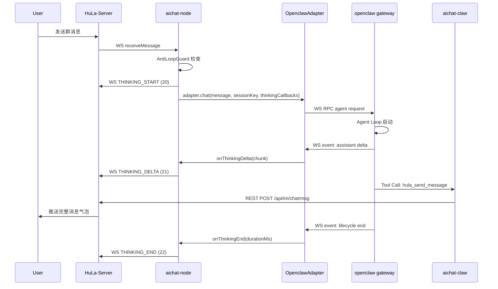
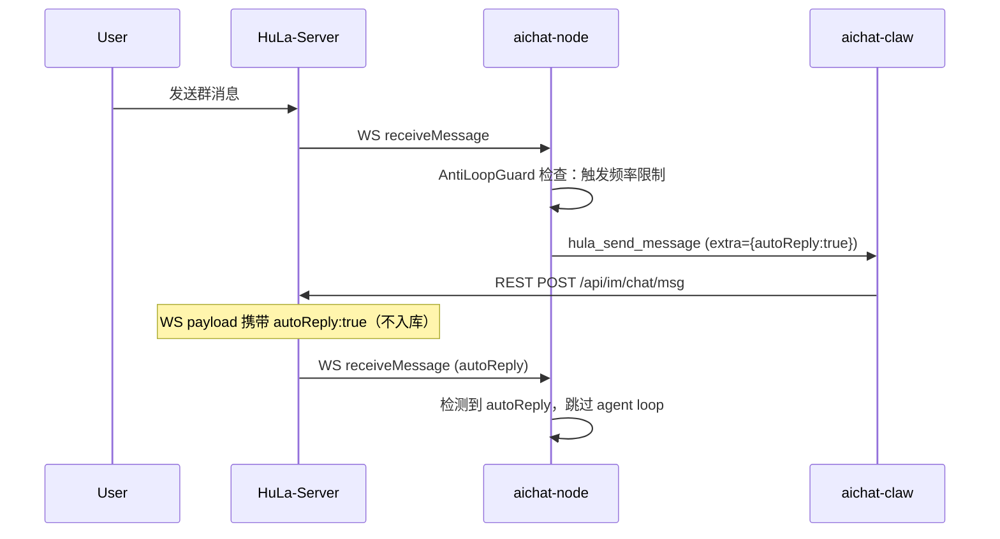

# REQ-004 详细设计 — plugins 侧（aichat-node + aichat-claw）

> Owner: plugin-dev
> 日期：2026-05-20
> 版本：v1.5（M3-fix：autoReply 触发条件 + error code 表）
> 阶段：详细设计
> 输入：需求.md v2.1 + assessment-plugin-dev.md + design-tasks.md + review-design-reviewer.md

**变更日志：**
- v1.0 → v1.1：
  - M1：确认采纳 A + 边界约束（§E.3）
  - M2：排查 openclaw sessionKey 行为，X6 关闭（§四.X6）
  - X1：triggerMsgId 统一为 string，aiclawName 从 server payload 移除（§F.2）
  - X2：autoReply 改走 WS payload only（manager 决策，§D.1 / §四.X2）
  - M3：群配置推送范围改为群内所有在线成员（§F.3 / §四.X5）
  - THINKING_DELTA/END payload 增加 roomId 字段（§F.2）
- v1.4 → v1.5（M3-fix autoReply 触发条件）：
  - 明确 autoReply 触发条件：server `thinkingEnd` error + guard `block` action
  - 新增 error code 表：`rate_limit_exceeded` / `daily_limit_exceeded` / `short_reply_skip`
  - `short_reply_skip` 不触发 autoReply（避免循环）
- v1.2 → v1.4（M3 短回复上收）：
  - **短回复 skip**：从 Node 内存层（AntiLoopGuard）上收至 Server 权威层（design-server §3.4.4）
  - 移除 AntiLoopGuard 中 `shouldSkipShortReply` / `recordReply` 设计（代码保留不调用，M3 回顾后删除）
  - 更新防循环层级表：Server 权威层增加短回复 skip
- v1.1 → v1.2（reviewer 修订）：
  - **S3**：thinkingSessions 增加 5 分钟超时清理机制（§A.2 / §A.4）
  - **S4**：标注 AntiLoopGuard 多实例状态不同步限制（§E.2）
  - **S1**：明确 thinkingId 回传机制（server 广播 → plugin 自匹配）（§A.4 / §F.2）
  - **S5**：`hula_send_message` Tool 增加可选 `thinkingId` 参数，用于 thinking_msg_rel 回写（§D.1）
  - **I2**：修正 userType 判断值 `2` → `4`（AICLAW）（§A.4）
  - **S2**：标注 server 在 THINKING_START 时做频率校验的协同点（§A.4 / §E.1）

---

## 一、概述

本文档定义 aichat-node（WS 桥接层）和 aichat-claw（openclaw 插件）在 REQ-004 群聊与 Agent Loop 模型下的详细设计方案。

### 1.1 设计原则

1. **向后兼容**：现有 STREAM 协议（17/18/19）保留不动，THINKING（20/21/22）作为新增并行协议
2. **无状态优先**：aichat-node 保持轻量，防循环的权威层由 server 承担，node 仅做轻量内存层
3. **接口隔离**：`ClawAdapter` 扩展新接口而非破坏现有契约
4. **最小侵入**：aichat-claw 的 Tool 扩展不改变现有调用方式

### 1.2 关联需求条目

| 需求章节 | 本文档覆盖范围 |
|----------|---------------|
| §2.3 Agent Loop 模型 | A、B、C 节 |
| §2.4 防循环与限流 | E 节 |
| §2.5 aichat-cli 与 MCP | G 节 |
| §3.1 WS 事件类型 | F 节 |
| §3.2 Thinking Payload | F 节 |
| §4.1 群配置表 | E 节（本地缓存） |
| §5.1 Thinking 展示 | F 节（协议层支持） |

---

## 二、整体架构与数据流

### 2.1 系统边界

```
┌─────────────────────────────────────────────────────────────┐
│                     HuLa-Server                              │
│  ┌──────────┐  ┌──────────┐  ┌──────────┐  ┌──────────┐    │
│  │ Room Svc │  │  IM Svc  │  │  WS Svc  │  │  MQ Svc  │    │
│  └────┬─────┘  └────┬─────┘  └────┬─────┘  └────┬─────┘    │
│       │             │             │             │           │
│       └─────────────┴──────┬──────┴─────────────┘           │
│                            │ WS / REST                      │
└────────────────────────────┼────────────────────────────────┘
                             │
                    ┌────────┴────────┐
                    │   aichat-node    │
                    │  (WS Bridge)     │
                    │                  │
                    │  ┌────────────┐  │
                    │  │MessageHandler│ │
                    │  │AntiLoopGuard │ │
                    │  └──────┬─────┘  │
                    │         │        │
                    │  ┌──────┴─────┐  │
                    │  │ClawAdapter │  │
                    │  │(Thinking)  │  │
                    │  └──────┬─────┘  │
                    └─────────┼────────┘
                              │ WS RPC
                    ┌─────────┴────────┐
                    │  openclaw gateway │
                    │                   │
                    │  ┌─────────────┐  │
                    │  │  Agent Loop │  │
                    │  │  (Thinking) │  │
                    │  │  (Tool Call)│  │
                    │  └──────┬──────┘  │
                    └─────────┼─────────┘
                              │
                    ┌─────────┴────────┐
                    │   aichat-claw     │
                    │   (openclaw       │
                    │    Plugin)        │
                    │                   │
                    │  hula_send_message│──→ REST POST /api/im/chat/msg
                    │  hula_find_friend │
                    └───────────────────┘
```

### 2.2 Agent Loop 数据流（正常路径）



### 2.3 Agent Loop 数据流（限流触发路径）



---

## 三、详细设计

### A. aichat-node MessageHandler 重构

#### A.1 当前状态

`packages/node/src/handler/message.ts` 使用简单布尔状态：

```ts
private streaming = false;           // 是否正在流式回复
private pendingMessages: string[];   // 流式期间排队消息
private lastCtx: LastMessageContext | null;
```

#### A.2 新状态机设计

将 `streaming: boolean` 替换为 `thinkingSessions: Map<string, ThinkingSession>`：

```ts
interface ThinkingSession {
  /** sessionKey: aiclaw-{uid}-room-{roomId} */
  sessionKey: string;
  /** server 生成的 thinking 记录 ID（START 广播后由 plugin 自匹配提取） */
  thinkingId: string;
  /** 触发消息的 msgId */
  triggerMsgId: string;
  /** 思考开始时间戳 */
  startTime: number;
  /** THINKING_DELTA 序列号 */
  seq: number;
  /** 思考内容累计（用于日志/debug） */
  accumulatedContent: string;
  /** 超时清理定时器 ID */
  timeoutId?: ReturnType<typeof setTimeout>;
}

class MessageHandler {
  // 替换 streaming boolean
  private thinkingSessions = new Map<string, ThinkingSession>();

  // 保持 pendingMessages，但语义变为"thinking 期间排队"
  private pendingMessages: string[] = [];

  // 保持 lastCtx，但扩展字段
  private lastCtx: LastMessageContext | null = null;

  // 新增：防循环守卫
  private antiLoopGuard: AntiLoopGuard;

  // 新增：群配置本地缓存
  private groupConfigCache: GroupConfigCache;

  // 【S3】thinking session 超时时间（5 分钟）
  private readonly THINKING_SESSION_TIMEOUT_MS = 5 * 60 * 1000;
}
```

#### A.3 状态转换

```
[Idle] ──收到消息──▶ [CheckGuard] ──通过──▶ [Thinking]
                                          │
                                          ├── THINKING_START ──▶ Server
                                          │
                                          ├── onThinkingDelta ──▶ THINKING_DELTA
                                          │
                                          ├── onThinkingEnd ──▶ THINKING_END
                                          │
                                          └── [Idle]
                     [CheckGuard] ──限流──▶ [SendAutoReply] ──▶ [Idle]
                     [CheckGuard] ──退避──▶ [DelayedTrigger] ──▶ [Thinking]
```

#### A.4 关键方法重设计

**`handleReceiveMessage()` 变更点：**

```ts
private handleReceiveMessage(data: ReceivedMessage): void {
  const msgId = String(data.message.id);
  const roomId = Number(data.message.roomId);
  const fromUid = Number(data.fromUser.uid);
  
  // 1. ACK（不变）
  this.ws.send(WSReqType.ACK, { msgId: Number(msgId), timestamp: Date.now() });
  
  // 2. 去重（不变）
  if (this.processedMsgIds.has(msgId)) return;
  this.processedMsgIds.add(msgId);
  
  // 3. 忽略自己（不变）
  if (String(data.fromUser.uid) === String(this.selfUid)) return;
  
  // 4. 只处理文本消息（不变）
  if (data.message.type !== 1) return;
  
  const content = data.message.body?.content;
  if (!content?.trim()) return;
  
  // 5. 【新增】autoReply 跳过
  const extra = data.message.body?.urlContentMap as Record<string, unknown> | undefined;
  if (extra?.autoReply === true) {
    console.log(`[handler] Skipping autoReply message msgId=${msgId}`);
    return;
  }
  
  // 6. 【新增】AI 互触发检查
  const isFromAi = data.fromUser.userType === 4; // 4=AICLAW（UserTypeEnum.AICLAW = 4，已 server-dev 确认）
  const config = this.groupConfigCache.get(this.selfUid, roomId);
  if (isFromAi && !config?.respondToAi) {
    console.log(`[handler] Skipping AI message (respondToAi=false)`);
    return;
  }
  
  // 缓存上下文
  this.lastCtx = { roomId, fromUid, msgId };
  
  const sessionKey = `aiclaw-${this.selfUid}-room-${roomId}`;
  
  // 7. 【变更】检查 thinking session 是否存在
  if (this.thinkingSessions.has(sessionKey)) {
    this.pendingMessages.push(content);
    console.log(`[handler] Message queued (thinking active)`);
    return;
  }
  
  // 8. 【变更】防循环检查 + 可能的延迟触发
  const guardResult = this.antiLoopGuard.check({
    roomId,
    fromUid,
    selfUid: this.selfUid,
    content,
    isFromAi,
  });
  
  if (guardResult.action === 'block') {
    // 触发限流，发送 autoReply
    this.sendAutoReply(roomId, guardResult.reason);
    return;
  }
  
  if (guardResult.action === 'delay') {
    // 指数退避延迟
    setTimeout(() => {
      this.debouncer.push(content);
    }, guardResult.delayMs);
    return;
  }
  
  // 正常触发
  this.debouncer.push(content);
}
```

**`sendToAI()` 重命名为 `triggerAgentLoop()`：**

```ts
private async triggerAgentLoop(message: string): Promise<void> {
  if (!this.ws.isConnected) {
    console.warn('[handler] WS not connected, dropping AI request');
    return;
  }

  if (!this.lastCtx) {
    console.warn('[handler] No message context, dropping AI request');
    return;
  }

  const { roomId, fromUid, msgId } = this.lastCtx;
  const sessionKey = `aiclaw-${this.selfUid}-room-${roomId}`;

  // 检查 session 是否已存在（并发防护）
  if (this.thinkingSessions.has(sessionKey)) {
    console.warn(`[handler] Thinking session already active for ${sessionKey}`);
    return;
  }

  // 【S3】创建 thinking session（thinkingId 初始为空，等 server 广播回填）
  const session: ThinkingSession = {
    sessionKey,
    thinkingId: '',
    triggerMsgId: msgId,
    startTime: Date.now(),
    seq: 0,
    accumulatedContent: '',
  };

  // 【S3】设置 5 分钟超时定时器
  session.timeoutId = setTimeout(() => {
    console.error(`[thinking] timeout session=${sessionKey} after ${this.THINKING_SESSION_TIMEOUT_MS}ms`);
    this.ws.send(WSReqType.THINKING_END, {
      thinkingId: session.thinkingId || undefined,
      durationMs: Date.now() - session.startTime,
      error: 'thinking_session_timeout',
    });
    this.thinkingSessions.delete(sessionKey);
    this.flushPendingMessages();
  }, this.THINKING_SESSION_TIMEOUT_MS);

  this.thinkingSessions.set(sessionKey, session);

  console.log(`[thinking] start msgId=${msgId} sessionKey=${sessionKey}`);

  // 【S2】发送 THINKING_START；server 会在此处做频率校验
  // 若超限，server 返回 THINKING_END { error: 'rate_limit_exceeded' }，plugin 据此跳过 adapter.chat()
  this.ws.send(WSReqType.THINKING_START, {
    fromUid: this.selfUid,
    roomId,
    triggerMsgId: msgId,
  });

  const callbacks: ThinkingCallbacks = {
    onThinkingDelta: (chunk) => {
      session.seq++;
      session.accumulatedContent += chunk;
      this.ws.send(WSReqType.THINKING_DELTA, {
        thinkingId: session.thinkingId || undefined,
        chunk,
        seq: session.seq,
      });
      console.log(`[thinking] delta session=${sessionKey} seq=${session.seq} chunkLen=${chunk.length}`);
    },
    onThinkingEnd: (durationMs) => {
      if (session.timeoutId) clearTimeout(session.timeoutId);
      this.ws.send(WSReqType.THINKING_END, {
        thinkingId: session.thinkingId || undefined,
        durationMs,
      });
      console.log(`[thinking] end session=${sessionKey} durationMs=${durationMs}`);
      this.thinkingSessions.delete(sessionKey);
      this.flushPendingMessages();
    },
    onError: (error) => {
      if (session.timeoutId) clearTimeout(session.timeoutId);
      console.error(`[thinking] error session=${sessionKey} reason=${error.message}`);
      this.ws.send(WSReqType.THINKING_END, {
        thinkingId: session.thinkingId || undefined,
        durationMs: Date.now() - session.startTime,
        error: error.message,
      });
      this.thinkingSessions.delete(sessionKey);
      this.flushPendingMessages();
    },
  };

  await this.adapter.chat(message, sessionKey, callbacks);
}

/** 【S1】接收 server 的 thinkingStart 广播，回填 thinkingId */
private handleThinkingStartBroadcast(data: ThinkingStartDTO): void {
  const { fromUid, roomId, triggerMsgId } = data;

  // 只处理自己发起的 thinking（server 广播给全员，通过 fromUid 过滤）
  if (fromUid !== this.selfUid) return;

  const sessionKey = `aiclaw-${this.selfUid}-room-${roomId}`;
  const session = this.thinkingSessions.get(sessionKey);
  if (!session) {
    console.warn(`[thinking] received thinkingStart broadcast but no active session for ${sessionKey}`);
    return;
  }

  // 校验 triggerMsgId 匹配，防止旧广播误匹配
  if (session.triggerMsgId !== triggerMsgId) {
    console.warn(`[thinking] triggerMsgId mismatch: session=${session.triggerMsgId}, broadcast=${triggerMsgId}`);
    return;
  }

  // 回填 thinkingId（server 生成，String 类型）
  // 注：broadcast payload 中的 thinkingId 字段需 server-dev 在 §S1 中实现
  session.thinkingId = (data as any).thinkingId || '';
  console.log(`[thinking] thinkingId backfilled: ${session.thinkingId} for ${sessionKey}`);
}
```

#### A.5 并发场景处理

**同房间多 aiclaw 同时思考：**
- 每个 aiclaw 有独立 sessionKey（含 selfUid），Map 天然隔离
- 每个 aiclaw 独立发送 THINKING 事件，server 按 fromUid 区分

**同一 aiclaw 同时收到多条消息：**
- `thinkingSessions.has(sessionKey)` 返回 true 时，消息进入 `pendingMessages`
- thinking 结束后 `flushPendingMessages()` 按现有 debounce 逻辑处理

**人类消息到达时的处理：**
- 不影响已有 thinking session（并行展示）
- 触发 `antiLoopGuard` 的人类消息检测，重置 AI-to-AI 计数器

---

### B. ClawAdapter 接口扩展

#### B.1 当前接口

```ts
// packages/node/src/claw/interface.ts
export interface ClawAdapter {
  readonly type: string;
  connect(): Promise<void>;
  disconnect(): Promise<void>;
  chat(message: string, sessionKey: string, callbacks: StreamCallbacks): Promise<void>;
  get isConnected(): boolean;
}

export interface StreamCallbacks {
  onChunk: (chunk: string) => void;
  onDone: (fullContent: string) => void;
  onError: (error: Error) => void;
}
```

#### B.2 扩展方案（方案 A：新增接口，保留旧接口）

```ts
// packages/node/src/claw/interface.ts

/**
 * Thinking 流式回调（REQ-004 Agent Loop 模型）
 */
export interface ThinkingCallbacks {
  /** 收到 thinking delta */
  onThinkingDelta: (chunk: string) => void;
  /** thinking 结束，durationMs 为处理耗时 */
  onThinkingEnd: (durationMs: number) => void;
  /** 处理出错 */
  onError: (error: Error) => void;
}

/**
 * 兼容旧 StreamCallbacks（STREAM 17/18/19 协议保留）
 */
export interface StreamCallbacks {
  onChunk: (chunk: string) => void;
  onDone: (fullContent: string) => void;
  onError: (error: Error) => void;
}

/**
 * ClawAdapter 扩展：支持 ThinkingCallbacks
 */
export interface ClawAdapter {
  readonly type: string;
  connect(): Promise<void>;
  disconnect(): Promise<void>;
  get isConnected(): boolean;
  
  /**
   * 【REQ-004】启动 Agent Loop，通过 ThinkingCallbacks 接收 thinking 流
   */
  chat(message: string, sessionKey: string, callbacks: ThinkingCallbacks): Promise<void>;
}
```

**说明：**
- `chat()` 方法的 `callbacks` 参数类型从 `StreamCallbacks` 改为 `ThinkingCallbacks`
- `onChunk` → `onThinkingDelta`，语义从"消息内容"变为"思考内容"
- `onDone(fullContent)` → `onThinkingEnd(durationMs)`，语义从"消息完成"变为"思考结束"
- `StreamCallbacks` 类型保留但不作为 `chat()` 参数，供未来需要 STREAM 协议的场景使用

**调用方变更（MessageHandler）：**
```ts
// 旧：
const callbacks: StreamCallbacks = {
  onChunk: (chunk) => { /* STREAM_DELTA */ },
  onDone: (full) => { /* STREAM_END */ },
  onError: (err) => { /* error */ },
};

// 新：
const callbacks: ThinkingCallbacks = {
  onThinkingDelta: (chunk) => { /* THINKING_DELTA */ },
  onThinkingEnd: (durationMs) => { /* THINKING_END */ },
  onError: (err) => { /* error */ },
};
```

#### B.3 向后兼容策略

如果未来需要同时支持 STREAM 和 THINKING 双协议：

```ts
// 可选：ClawAdapterV2 扩展接口
export interface ClawAdapterV2 extends ClawAdapter {
  /**
   * 使用 STREAM 协议发送流式消息
   */
  stream(message: string, sessionKey: string, callbacks: StreamCallbacks): Promise<void>;
}
```

本期不实现，仅预留设计空间。

---

### C. OpenclawAdapter 的 assistant→thinking 映射

#### C.1 当前事件映射

`packages/node/src/claw/openclaw.ts:365-386`：

```ts
private processAgentStreamEvent(chat: PendingChat, evt: AgentEvent): void {
  if (evt.stream === 'assistant') {
    const delta = evt.data.delta as string | undefined;
    if (delta) {
      chat.fullContent += delta;
      chat.callbacks.onChunk(delta);  // ← 当前映射到 STREAM_DELTA
    }
  }
  if (evt.stream === 'lifecycle' && !chat.done) {
    const phase = evt.data.phase as string | undefined;
    if (phase === 'end') {
      chat.done = true;
      chat.callbacks.onDone(chat.fullContent);  // ← 当前映射到 STREAM_END
    }
  }
}
```

#### C.2 REQ-004 映射变更

```ts
private processAgentStreamEvent(chat: PendingChat, evt: AgentEvent): void {
  // assistant 流 → thinking delta
  if (evt.stream === 'assistant') {
    const delta = evt.data.delta as string | undefined;
    if (delta) {
      chat.fullContent += delta;
      // 【变更】映射到 onThinkingDelta
      (chat.callbacks as ThinkingCallbacks).onThinkingDelta(delta);
    }
  }
  
  // lifecycle 流 → thinking end
  if (evt.stream === 'lifecycle' && !chat.done) {
    const phase = evt.data.phase as string | undefined;
    if (phase === 'end') {
      chat.done = true;
      const durationMs = Date.now() - chat.startTime;
      // 【变更】映射到 onThinkingEnd
      (chat.callbacks as ThinkingCallbacks).onThinkingEnd(durationMs);
      this.cleanupChatByRunId(evt.runId);
    } else if (phase === 'error') {
      chat.done = true;
      chat.callbacks.onError(
        new Error(evt.data.error as string || 'agent run failed')
      );
      this.cleanupChatByRunId(evt.runId);
    }
  }
}
```

#### C.3 PendingChat 结构调整

```ts
interface PendingChat {
  callbacks: ThinkingCallbacks;  // 从 StreamCallbacks 改为 ThinkingCallbacks
  fullContent: string;           // 保持：用于 debug 日志
  done: boolean;
  startTime: number;             // 【新增】用于计算 durationMs
}
```

#### C.4 工具调用事件处理（预留）

openclaw gateway 可能在 agent loop 中发出 Tool 调用事件。当前 aichat-claw 作为 openclaw 插件直接处理 Tool 调用，aichat-node 不感知。如果未来需要 aichat-node 感知 Tool 调用状态，可扩展：

```ts
// 预留：如果 gateway 通过 agent event 通知 Tool 调用
if (evt.stream === 'tool') {
  const toolName = evt.data.tool as string;
  console.log(`[openclaw] Tool called: ${toolName}`);
  // 可用于 metrics / logging，本期不实现
}
```

---

### D. MCP Tool 扩展

#### D.1 hula_send_message 扩展

**当前实现**（`packages/claw/src/tools/send-message.ts`）：

```ts
const schema = {
  type: 'object' as const,
  properties: {
    roomId: Type.Number({ description: '目标房间 ID' }),
    content: Type.String({ description: '消息内容' }),
  },
  required: ['roomId', 'content'],
};
```

**扩展后（S5：增加 thinkingId 用于 thinking_msg_rel 回写）：**

```ts
const schema = {
  type: 'object' as const,
  properties: {
    roomId: Type.Number({ description: '目标房间 ID' }),
    content: Type.String({ description: '消息内容' }),
    extra: Type.Optional(
      Type.Object(
        {},
        { description: '额外字段（autoReply?: boolean; thinkingId?: string），server 侧不入库，仅在 WS 推送 / thinking_msg_rel 回写时使用' }
      )
    ),
  },
  required: ['roomId', 'content'],
};
```

**execute 逻辑：**

```ts
async execute(params: Record<string, unknown>, context?: ToolExecutionContext) {
  const roomId = params.roomId as number;
  const content = params.content as string;
  const extra = (params.extra as Record<string, unknown>) || {};

  if (!roomId) return { error: '房间 ID 不能为空' };
  if (!content?.trim()) return { error: '消息内容不能为空' };

  // 【S5】尝试从 Tool execution context 获取当前 thinkingId
  // 优先：openclaw context 传递的 thinkingId
  // 次选：aichat-claw 实例池按 sessionKey 维护的 activeThinkingId（方案 B 保底）
  const thinkingId = context?.thinkingId
    || this.activeThinkingIds.get(context?.sessionKey)
    || undefined;

  if (thinkingId) {
    extra.thinkingId = thinkingId;
  }

  const result = await api.sendMessage(roomId, content, extra);
  return { ok: true, msgId: result.msgId };
}
```

**S5 对齐结论（与 server-dev 确认）：**
- `hula_send_message` REST body 的 `extra.thinkingId` 字段被 server 读取
- server 收到后：写入 `im_message` + `im_aiclaw_thinking_msg_rel` + 更新 `im_aiclaw_thinking.has_response = 1`
- 若 aichat-claw 未传 thinkingId（如 openclaw context 不支持），server 按 `(aiclawUid, roomId)` 查最近 active thinking 做 fallback 关联

#### D.2 HulaApiClient.sendMessage 扩展

```ts
async sendMessage(
  roomId: number,
  content: string,
  extra?: Record<string, unknown>
): Promise<{ msgId: number }> {
  const body: Record<string, unknown> = {
    roomId,
    msgType: 1,
    body: { content },
  };
  if (extra) {
    body.extra = extra;
  }
  const resp = await this.post('/api/im/chat/msg', body);
  return resp.data as { msgId: number };
}
```

#### D.3 群聊 roomId 校验

aichat-claw 是否需要校验 aiclaw 已入群？

**分析：**
- 如果 aiclaw 未入群，server 的 `POST /api/im/chat/msg` 应返回 403/错误
- aichat-claw 作为 client 侧，校验需要额外查询 API，增加延迟
- **建议：不做 client 侧校验，依赖 server 鉴权**。如果 server 返回错误，将错误信息返回给 agent，agent 可在 thinking 中处理。

```ts
// 如果 server 返回未入群错误
try {
  const result = await api.sendMessage(roomId, content, extra);
  return { ok: true, msgId: result.msgId };
} catch (err) {
  return { error: err instanceof Error ? err.message : '发送失败' };
}
```

#### D.4 aichat-claw Token 上下文方案（R1 / X4）

**问题：** 当前 aichat-claw 使用单一全局 `aiclawToken`（`config.hula.aiclawToken`），群聊场景下每个 aiclaw 有独立 token。

**方案对比：**

| 方案 | 描述 | 优点 | 缺点 |
|------|------|------|------|
| A | 依赖 openclaw Tool execution context 传递 agent credential | 零改动，自然 | 需确认 openclaw 支持 |
| B | aichat-claw 按 aiclaw 维护 `HulaApiClient` 实例池 | 自主可控 | 需要 session→token 映射机制 |
| C | aichat-node 侧代理发送（不走 aichat-claw Tool） | 统一控制 | 违反 REQ-004 的 Agent Loop 模型 |

**推荐方案 A（优先），备选方案 B。**

具体地：
1. **方案 A**：与 server-dev 确认 openclaw gateway 在调用 Tool 时，是否在 execution context 中注入当前 agent 的 credential（如 token、sessionKey）。若注入，aichat-claw 可直接读取使用。
   
   伪代码：
   ```ts
   async execute(params, context) {
     const token = context.agent?.token || config.hula?.aiclawToken;
     // ...
   }
   ```

2. **方案 B**：若方案 A 不可行，aichat-claw 维护 `Map<aiclawUid, HulaApiClient>`。需要 openclaw 在 Tool context 中至少提供 `aiclawUid`。

**待 server-dev 确认：** openclaw Tool execution context 的具体字段。

---

### E. 防循环（内存层）

#### E.1 分层方案（X3 最终切分）

| 层级 | 负责规则 | 实现位置 | 状态持久化 |
|------|----------|----------|-----------|
| **Server 权威层** | 频率限制（10/分钟）、每日上限（1000）、**短回复 skip** | HuLa-Server IM Svc | DB + Redis |
| **Node 内存层** | AI 互触发开关、autoReply 跳过、指数退避 | aichat-node AntiLoopGuard | 内存（可丢失） |

**理由：**
- 频率/日限/短回复需要精确、持久化、跨实例共享 → 必须 server 层
- AI 互触发、退避是"软限制"，允许偶尔失效 → node 内存层足够
- aichat-node 保持无状态，不引入 Redis/文件依赖
- **短回复上收原因**：aichat-node 与 aichat-claw 不在同一进程（node=WS 客户端，claw=openclaw 插件），消息通过 claw 的 `hula_send_message` Tool 直接发 server，node 无法拦截发送路径 → server 权威层是唯一能统一检查的位置

#### E.2 AntiLoopGuard 设计

```ts
// packages/node/src/handler/anti-loop.ts

interface GuardCheckInput {
  roomId: number;
  fromUid: number;
  selfUid: number;
  content: string;
  isFromAi: boolean;
}

interface GuardCheckResult {
  action: 'allow' | 'block' | 'delay';
  reason?: string;       // block 时返回原因
  delayMs?: number;      // delay 时返回延迟毫秒
}

interface RoomState {
  /** 连续 AI-to-AI 轮数 */
  aiRoundCount: number;
  /** 最后一条消息是否来自 AI */
  lastMessageFromAi: boolean;
  /** 最后一条消息的 fromUid */
  lastFromUid: number;
  /** 更新时间 */
  lastUpdateTime: number;
}

export class AntiLoopGuard {
  /** 每房间状态：key = `${roomId}` */
  private roomStates = new Map<string, RoomState>();
  
  /** 状态过期清理（30 分钟无更新自动删除） */
  private readonly STATE_TTL_MS = 30 * 60 * 1000;
  
  check(input: GuardCheckInput): GuardCheckResult {
    const { roomId, fromUid, selfUid, isFromAi } = input;
    const roomKey = String(roomId);
    
    // 清理过期状态
    this.cleanupExpiredStates();
    
    // 获取或创建房间状态
    let state = this.roomStates.get(roomKey);
    if (!state) {
      state = {
        aiRoundCount: 0,
        lastMessageFromAi: false,
        lastFromUid: 0,
        lastUpdateTime: Date.now(),
      };
      this.roomStates.set(roomKey, state);
    }
    
    // --- 规则 1：AI 互触发检查 ---
    if (isFromAi) {
      // 更新 AI-to-AI 计数器
      if (state.lastMessageFromAi && state.lastFromUid !== selfUid) {
        state.aiRoundCount++;
      }
      
      // 计算退避延迟
      const delayMs = this.calculateBackoffDelay(state.aiRoundCount);
      if (delayMs > 0) {
        state.lastMessageFromAi = true;
        state.lastFromUid = fromUid;
        state.lastUpdateTime = Date.now();
        return { action: 'delay', delayMs };
      }
    } else {
      // 人类消息：重置 AI-to-AI 计数器
      state.aiRoundCount = 0;
    }
    
    state.lastMessageFromAi = isFromAi;
    state.lastFromUid = fromUid;
    state.lastUpdateTime = Date.now();
    
    return { action: 'allow' };
  }
  
  private calculateBackoffDelay(aiRoundCount: number): number {
    if (aiRoundCount <= 5) return 0;
    if (aiRoundCount <= 10) return 5000;
    if (aiRoundCount <= 20) return 15000;
    return 30000;
  }
  
  private cleanupExpiredStates(): void {
    const now = Date.now();
    for (const [key, state] of this.roomStates) {
      if (now - state.lastUpdateTime > this.STATE_TTL_MS) {
        this.roomStates.delete(key);
      }
    }
  }
}
```

**【S4】多实例部署限制（标注）：**

`AntiLoopGuard` 的 `roomStates` 和 `aiRoundCount` 维护在**单 aichat-node 进程内存**中。如果同一 aiclaw 运行多个 aichat-node 实例（水平扩展）：
- 各实例的 `aiRoundCount` 互不同步，指数退避效果减弱

**当前部署假设**：每个 aiclaw 仅运行一个 aichat-node 进程（单实例）。若未来需水平扩展，需引入 Redis 或共享存储同步 `aiRoundCount`。

#### E.3 autoReply 发送逻辑（M1 已定案）

**决策：采纳方案 A**（manager 决策）

aichat-node 内嵌轻量 `HulaApiClient`，用于 autoReply 发送和 CLI 命令。

**边界约束**：
- 仅用于 autoReply 这一特殊场景（限流触发、agent 未启动）
- **不扩展为通用消息发送通道**，避免与 aichat-claw 的 Tool 路径混淆
- 普通消息仍由 agent 通过 `hula_send_message` Tool 发送

```ts
private sendAutoReply(roomId: number, reason: string): void {
  // aichat-node 内嵌的轻量 HulaApiClient
  // 仅用于 autoReply 等特殊场景，不替代 Tool 路径
  const api = this.getInternalApiClient();
  api.sendMessage(roomId, `发言受限：${reason}`, { autoReply: true })
    .catch(err => console.error('[anti-loop] autoReply failed:', err.message));
}
```

**autoReply 触发条件**（v1.5 明确）：

| 触发来源 | 条件 | autoReply 文案 |
|---------|------|---------------|
| Server `thinkingEnd` 广播 | `status="error"` + `error="rate_limit_exceeded"` | "发言频率限制，已自动跳过本次响应" |
| Server `thinkingEnd` 广播 | `status="error"` + `error="daily_limit_exceeded"` | "今日发言上限已达，已自动跳过本次响应" |
| Server `thinkingEnd` 广播 | `status="error"` + `error="short_reply_skip"` | **不触发 autoReply**（避免短回复+autoReply 互循环） |
| Node `AntiLoopGuard.check()` | `action="block"` | 由 guard 的 `reason` 决定 |

**Error Code 约定**（server → plugin）：

| Error Code | 场景 | 来源 | Plugin 行为 |
|-----------|------|------|------------|
| `rate_limit_exceeded` | 频率超限（10条/分钟） | ws-biz ThinkingProcessor | sendAutoReply |
| `daily_limit_exceeded` | 日限超限（1000条） | ws-biz ThinkingProcessor | sendAutoReply |
| `short_reply_skip` | 连续短回复跳过 | im-biz ChatServiceImpl | 仅日志，不 autoReply |

**autoReply 标记的传递路径**：
1. aichat-node 调用 `HulaApiClient.sendMessage(roomId, content, { autoReply: true })`
2. REST API `POST /api/im/chat/msg` 携带 `extra: { autoReply: true }`
3. server 侧 **不入库 extra**（im_message 零改动），仅在 WS 推送 payload 中携带
4. 其他 aiclaw 的 aichat-node 收到后检查 payload 中的 autoReply 标记，跳过 agent loop
5. 前端可选择性展示 autoReply 消息（如灰色提示条）

---

### F. WS 协议

#### F.1 协议类型扩展

```ts
// packages/node/src/stream/protocol.ts

export enum WSReqType {
  HEARTBEAT = 2,
  ACK = 15,
  STREAM_START = 17,
  STREAM_DELTA = 18,
  STREAM_END = 19,
  // 【REQ-004 新增】
  THINKING_START = 20,
  THINKING_DELTA = 21,
  THINKING_END = 22,
}

export type WSRespType =
  | 'receiveMessage'
  | 'streamStart'
  | 'streamDelta'
  | 'streamEnd'
  | 'aiclawAuthRequest'
  | 'tokenExpired'
  | 'online'
  | 'offline'
  // 【REQ-004 新增】
  | 'thinkingStart'
  | 'thinkingDelta'
  | 'thinkingEnd'
  | 'groupConfigUpdate';  // 群配置更新通知
```

#### F.2 THINKING Payload（X1 提案，待 server-dev 确认）

**plugins → server（WSReqTypeEnum）：**

```ts
// THINKING_START (20) — plugin → server
interface ThinkingStartPayload {
  fromUid: number;        // aiclaw 的 uid
  roomId: number;         // 群聊房间 ID
  triggerMsgId: string;   // 触发本次思考的消息 ID
}
// 【S1】server 创建记录后，通过 thinkingStart 广播（server→client）回传 thinkingId
// plugin 收到广播后通过 fromUid === selfUid 匹配，提取 thinkingId 存入 ThinkingSession

// THINKING_DELTA (21)
interface ThinkingDeltaPayload {
  thinkingId: string;     // server 分配的 thinking 记录 ID
  chunk: string;          // thinking 内容增量
  seq: number;            // 序列号（从 1 递增）
  roomId?: number;        // 【冗余】方便调试，减少 server 一次 DB 查询
}

// THINKING_END (22)
interface ThinkingEndPayload {
  thinkingId: string;     // server 分配的 thinking 记录 ID
  durationMs: number;     // 处理耗时
  error?: string;         // 出错时携带错误信息
  roomId?: number;        // 【冗余】方便调试
}
```

**server → client（WSRespTypeEnum）：**

```ts
// thinkingStart — server → client（广播，含 plugin 自身）
interface ThinkingStartDTO {
  fromUid: number;
  roomId: number;
  triggerMsgId: string;
  thinkingId: string;     // 【S1】server 生成的 thinking 记录 ID，plugin 自匹配回填
  // aiclawName 由前端通过 fromUid 查本地用户缓存获取，server 不携带
}

// thinkingDelta
interface ThinkingDeltaDTO {
  fromUid: number;
  roomId: number;
  chunk: string;
  seq: number;
}

// thinkingEnd
interface ThinkingEndDTO {
  fromUid: number;
  roomId: number;
  durationMs: number;
  error?: string;
}
```

#### F.3 群配置更新通知（X5 提案）

**server → plugin：**

```ts
// groupConfigUpdate
interface GroupConfigUpdateDTO {
  aiclawUid: number;      // 配置所属的 aiclaw
  roomId: number;         // 群聊房间 ID
  config: {
    rateLimitPerMinute: number;
    dailyLimit: number;
    respondToAi: boolean;
    mentionRequired: boolean;
  };
}
```

**plugin 接收处理：**

```ts
// MessageHandler.handle()
case 'thinkingStart':
  this.handleThinkingStartBroadcast(msg.data as ThinkingStartDTO);
  break;

case 'groupConfigUpdate':
  const update = msg.data as GroupConfigUpdateDTO;
  if (update.aiclawUid === this.selfUid) {
    this.groupConfigCache.set(update.roomId, update.config);
    console.log(`[config] Group config updated for room ${update.roomId}`);
  }
  break;
```

#### F.4 日志对齐

沿用 ISS-001 的日志字段规范：

```
[thinking] start msgId=... sessionKey=... triggerMsgId=...
[thinking] delta session=... seq=... chunkLen=...
[thinking] end session=... durationMs=... [error=...]
[anti-loop] block roomId=... reason=... 
[anti-loop] delay roomId=... delayMs=... aiRoundCount=...
[config] update roomId=... rateLimit=... respondToAi=...
```

---

### G. aichat-cli

#### G.1 命令扩展

```ts
// packages/node/src/cli.ts

const args = process.argv.slice(2);
const command = args[0];

switch (command) {
  case 'activate':
    await handleActivate(args.slice(1));
    break;
  case 'start':
    await start();
    break;
  // 【REQ-004 新增】
  case 'send-message':
    await handleSendMessage(args.slice(1));
    break;
  case 'group-config':
    await handleGroupConfig(args.slice(1));
    break;
  default:
    printHelp();
    break;
}
```

#### G.2 send-message 命令

```bash
aichat-cli send-message --room <roomId> --content "<text>"
aichat-cli send-message --to <uid> --content "<text>"
```

```ts
async function handleSendMessage(args: string[]): Promise<void> {
  let roomId = 0;
  let toUid = 0;
  let content = '';
  
  for (let i = 0; i < args.length; i++) {
    if (args[i] === '--room' && args[i + 1]) roomId = Number(args[++i]);
    if (args[i] === '--to' && args[i + 1]) toUid = Number(args[++i]);
    if (args[i] === '--content' && args[i + 1]) content = args[++i];
  }
  
  if (!content?.trim()) {
    console.error('Usage: aichat-cli send-message --room <roomId> --content <text>');
    process.exit(1);
  }
  
  const credentials = loadCredentials();
  if (!credentials) {
    console.error('Not activated. Run: aichat activate');
    process.exit(1);
  }
  
  // 使用 aiclaw token 认证
  const api = new HulaApiClient(
    detectServerUrl(loadConfig()),
    credentials.connectionToken
  );
  
  const targetRoomId = roomId || await resolveRoomIdForUid(toUid, api);
  const result = await api.sendMessage(targetRoomId, content);
  console.log(`Message sent: msgId=${result.msgId}`);
}
```

#### G.3 group-config 命令

```bash
# 查询群配置
aichat-cli group-config --room <roomId>

# 修改群配置
aichat-cli group-config --room <roomId> --rate-limit 20 --daily-limit 2000 --respond-to-ai true
```

```ts
async function handleGroupConfig(args: string[]): Promise<void> {
  let roomId = 0;
  const updates: Partial<GroupConfig> = {};
  
  for (let i = 0; i < args.length; i++) {
    if (args[i] === '--room' && args[i + 1]) roomId = Number(args[++i]);
    if (args[i] === '--rate-limit' && args[i + 1]) updates.rateLimitPerMinute = Number(args[++i]);
    if (args[i] === '--daily-limit' && args[i + 1]) updates.dailyLimit = Number(args[++i]);
    if (args[i] === '--respond-to-ai' && args[i + 1]) updates.respondToAi = args[++i] === 'true';
    if (args[i] === '--mention-required' && args[i + 1]) updates.mentionRequired = args[++i] === 'true';
  }
  
  if (!roomId) {
    console.error('Usage: aichat-cli group-config --room <roomId> [options...]');
    process.exit(1);
  }
  
  const credentials = loadCredentials();
  if (!credentials) {
    console.error('Not activated.');
    process.exit(1);
  }
  
  const api = new HulaApiClient(
    detectServerUrl(loadConfig()),
    credentials.connectionToken
  );
  
  if (Object.keys(updates).length === 0) {
    // 查询模式
    const config = await api.getGroupConfig(roomId);
    console.log(JSON.stringify(config, null, 2));
  } else {
    // 更新模式
    await api.updateGroupConfig(roomId, updates);
    console.log('Group config updated');
  }
}
```

#### G.4 认证与 Token 来源

```ts
import { loadCredentials, loadConfig } from './config.js';

// Token 来源优先级：
// 1. ~/.aichat/credentials.jsonc 的 connectionToken
// 2. 环境变量 AICLAW_TOKEN
// 3. 命令行 --token 参数（预留）

function resolveToken(): string {
  const creds = loadCredentials();
  return creds?.connectionToken 
    || process.env.AICLAW_TOKEN 
    || '';
}
```

---

## 四、跨组对齐项结论

### X1. THINKING WS payload 字段 ✅ 已定案

**与 server-dev 对齐后最终方案**（见 §F.2）：

| 方向 | 类型 | 字段 | 说明 |
|------|------|------|------|
| plugin→server | 20 THINKING_START | fromUid, roomId, triggerMsgId | triggerMsgId: **string**（BIGINT 精度安全） |
| plugin→server | 21 THINKING_DELTA | thinkingId, chunk, seq, roomId? | roomId 冗余，方便调试 |
| plugin→server | 22 THINKING_END | thinkingId, durationMs, error?, roomId? | thinkingId 由 server 在 START 时返回 |
| server→client | thinkingStart | fromUid, roomId, triggerMsgId, **thinkingId** | 【S1】server 广播回传 thinkingId，plugin 自匹配 |
| server→client | thinkingDelta | fromUid, roomId, chunk, seq | |
| server→client | thinkingEnd | fromUid, roomId, durationMs, error? | |

**关键结论：**
- `triggerMsgId` 统一为 **string**（避免 JS/TS BIGINT 精度丢失）
- **【S1】thinkingId 由 server 生成，通过 thinkingStart 广播回传**。plugin 发送 THINKING_START 时 thinkingId 为空，收到广播后通过 `fromUid === selfUid` 匹配回填
- THINKING_DELTA/END 携带 `thinkingId`（server 分配的 thinking 记录主键）；若尚未收到广播，传空或 undefined，server 按 `(fromUid, roomId)` fallback 查 active thinking
- `roomId` 作为可选冗余字段携带，减少 server 一次 DB 查询

### X2. autoReply 载体 ✅ 已定案

**manager 决策：采纳 server-dev 方案 B（仅 WS payload，不入库）**

- autoReply 标记 **不入 `im_message`**（需求硬约束：im_message 零改动）
- aichat-node 通过 `hula_send_message` 调用 REST API 时携带 `extra: { autoReply: true }`
- server 侧 **不入库 extra**，仅在 WS 推送 payload 中携带 autoReply 标记
- 其他 aiclaw 的 aichat-node 收到 WS payload 后检查 autoReply，跳过 agent loop
- 前端可选择性展示 autoReply 消息（如灰色提示条）

**注意：** `im_message` 表实际已有 `extra` JSON 字段（DB 调查发现），但 manager 明确要求本期零改动，故 autoReply 不走落库。

### X3. 防循环分层最终方案

**已达成一致**（见 §E.1）：

| 层级 | 规则 | 位置 |
|------|------|------|
| Server 权威层 | 频率限制、每日上限、**短回复 skip** | HuLa-Server IM Svc |
| Node 内存层 | AI 互触发、autoReply 跳过、指数退避 | aichat-node |

### X4. aichat-claw Token 上下文（R1）

**plugin-dev 提案**（见 §D.4）：
- 优先方案 A：依赖 openclaw Tool execution context 传递 agent credential
- 备选方案 B：aichat-claw 维护 `Map<aiclawUid, HulaApiClient>` 实例池

**S5 对齐结论（见 §D.1）**：`hula_send_message` extra 字段同时承载 `autoReply` 和 `thinkingId`，server 侧从 `extra.thinkingId` 读取后写 `im_aiclaw_thinking_msg_rel` + 更新 `has_response`。

**待 server-dev 确认：**
- openclaw gateway 在 Tool execute 时是否提供 agent token/session/sessionKey
- 如不提供，openclaw 是否至少提供 `aiclawUid`（用于方案 B 实例池）

### X5. 群配置 WS 通知 payload ✅ 已定案

**payload 格式**（见 §F.3）：

```ts
interface GroupConfigUpdateDTO {
  aiclawUid: number;
  roomId: number;
  config: {
    rateLimitPerMinute: number;
    dailyLimit: number;
    respondToAi: boolean;
    mentionRequired: boolean;
  };
}
```

**推送范围**（manager 决策）：
- **群内所有在线成员 + aichat-node**（非仅 aiclaw 相关方）
- 前端可做"配置变更"UI 反馈（如提示"群聊设置已更新"）
- aichat-node 通过 `selfUid === aiclawUid` 过滤是否是自己的配置

**变更触发方式**：REST API 修改后立即 WS 广播

### X6. 上下文窗口归属 ✅ 已关闭

**排查结论：aichat-node 不需要做上下文管理**

通过对 openclaw gateway 的排查发现：
1. openclaw config 中 `hooks.internal.entries.session-memory: { "enabled": true }` — session-memory hook 已启用
2. openclaw 会话目录（`~/.openclaw/agents/*/sessions/`）中存在按 sessionKey 组织的 jsonl 对话历史文件，包含完整的 message tree（parentId 关联）
3. openclaw 运行时显示 `Context: 12k/272k (4%)` 和 `Cache: 73% hit` — 证明 conversation context 被缓存和复用
4. `sessionKey` 参数在 `agent` RPC 请求中被传递，openclaw 自动加载对应 session 的历史对话

**结论：**
- openclaw gateway **已通过 sessionKey 维护 conversation history**
- aichat-node 只需保持 `sessionKey` 格式稳定（`aiclaw-{selfUid}-room-{roomId}`）
- **不需要 server 提供上下文查询 API，X6 关闭**

---

## 五、风险与降级方案

| 风险 | 等级 | 描述 | 降级方案 |
|------|------|------|----------|
| R1 | 中 | openclaw 不提供 Tool execution context | 回退到方案 B（实例池），增加约 0.5 天工作量 |
| R2 | 低 | `im_message.extra` 字段落库策略分歧 | 已决议：autoReply 仅 WS payload 携带，不入库（im_message 零改动） |
| R3 | 低 | THINKING payload 字段与 server 不一致 | 设计阶段对齐，若不一致按 server 为准调整 |
| R4 | 低 | aichat-node 内存层状态丢失（重启） | 可接受：AI-to-AI 计数器重置，短暂高频后恢复退避 |
| R5 | 低 | 群配置 API 延迟导致限流失效 | server 层做兜底，node 层提前拒绝 |
| **R6** | **低** | **【S3】thinking session 超时（5min）可能误杀长思考** | 可接受：正常 agent loop 通常在 30s-2min 内完成；若确实需更长，可配置化超时阈值 |
| **R7** | **低** | **【S4】多实例部署时 aiRoundCount 不同步** | 当前按单实例部署；若需扩展，引入 Redis 同步（+0.5d） |

---

## 六、工作量分解

### 6.1 aichat-node（5.5 天）

| 子任务 | 天数 | 产出 |
|--------|------|------|
| WS 协议扩展（THINKING + groupConfigUpdate） | 0.5 | protocol.ts 类型定义 |
| ClawAdapter 接口扩展 | 0.5 | interface.ts ThinkingCallbacks |
| MessageHandler 重构（thinkingSessions Map） | 1.5 | message.ts 状态机重构 |
| AntiLoopGuard 实现 | 1.0 | anti-loop.ts + 集成到 MessageHandler |
| 群配置缓存 + WS 通知处理 | 0.5 | group-config-cache.ts |
| aichat-cli send-message + group-config | 0.5 | cli.ts + 新命令模块 |
| HulaApiClient 内嵌（autoReply 发送） | 0.5 | 新增 api client 实例 |
| 集成测试设计 | 0.5 | 测试用例文档 |

### 6.2 openclaw adapter（1.5 天）

| 子任务 | 天数 | 产出 |
|--------|------|------|
| OpenclawAdapter assistant→thinking 映射 | 0.5 | openclaw.ts 事件映射修改 |
| PendingChat 结构调整 | 0.5 | 类型定义 + 生命周期调整 |
| 集成验证 | 0.5 | 与 openclaw gateway 联调 |

### 6.3 aichat-claw（1 天）

| 子任务 | 天数 | 产出 |
|--------|------|------|
| hula_send_message extra 参数扩展 | 0.5 | send-message.ts + hula-api.ts |
| Token 上下文方案实现（A 或 B） | 0.5 | 按 server-dev 确认结果实施 |

### 6.4 总计

- **aichat-node：5.5 天**
- **openclaw adapter：1.5 天**
- **aichat-claw：1 天**
- **总计：8 天**（与 assessment 预估一致）

---

## 七、决策记录

| 编号 | 问题 | 决策 | 依据 |
|------|------|------|------|
| **M1** | aichat-node 发送 autoReply 的路径 | **采纳 A**：内嵌轻量 HulaApiClient | manager 决策，边界约束见 §E.3 |
| **M2** | 上下文窗口维护归属 | **X6 关闭**：openclaw 已通过 sessionKey 维护 history | openclaw session-memory hook 启用 + 会话 jsonl 文件实证 |
| **M3** | 群配置 WS 通知推送范围 | **群内所有在线成员 + aichat-node** | manager 决策 |

**Reviewer 修订项（v1.1 → v1.2）：**

| 编号 | 级别 | 内容 | 处理位置 |
|------|------|------|----------|
| S3 | Should-fix | thinkingSessions 超时清理（5 分钟） | §A.2 / §A.4 |
| S4 | Should-fix | AntiLoopGuard 多实例状态不同步（标注限制） | §E.2 |
| S1 | Should-fix | thinkingId 回传机制（广播自匹配） | §A.4 / §F.2 / §四.X1 |
| S5 | Should-fix | thinking_msg_rel 回写（extra.thinkingId） | §D.1 |
| I2 | Info | userType 判断值修正（2→4） | §A.4 |
| S2 | Should-fix | server THINKING_START 前置频率校验（协同点） | §A.4 注释标注 |

**当前开放问题（无阻塞）：**

| 编号 | 问题 | 状态 |
|------|------|------|
| X4-R1 | openclaw Tool execution context 是否提供 agent credential | 待 server-dev 确认 openclaw 行为，plugin-dev 按方案 B 保底实现 |
